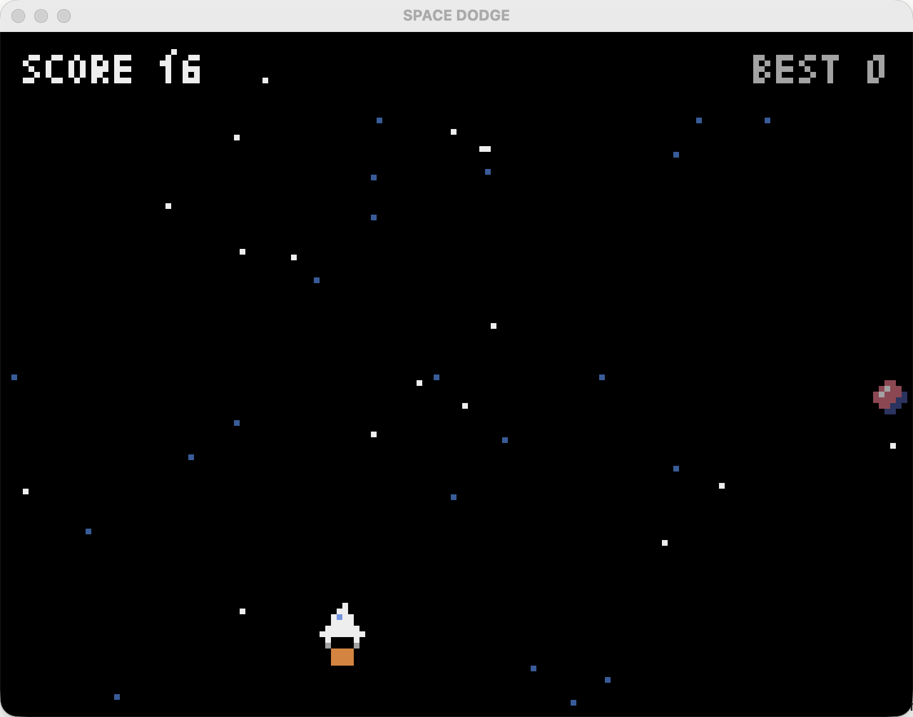

# pixel-game-generator

**English** | [简体中文](README.zh-CN.md)

An [Agent Skill](https://agentskills.io/specification) that turns **one sentence** into a **runnable retro pixel game** built with [Pyxel](https://github.com/kitao/pyxel). It sets up the Python environment, writes the game, and playtests it headlessly until it passes.

The same skill works in **Claude Code** and **[pi](https://www.npmjs.com/package/@earendil-works/pi-coding-agent)**, including with small models such as **GLM-5.3-flash**. It needs no MCP server and no vision model.



*Space Dodge: generated by pi + GLM-5.3-flash from the prompt "make a spaceship game dodging meteors".*

## How it works

```
"a spaceship dodging meteors"
        │
        ▼
1. Spec        GAME_SPEC.md: controls, objects, score, difficulty, lose rule, test plan
2. Environment scripts/setup_env.sh  → uv project + Python 3.12 + pyxel (idempotent)
3. Code        main.py from a fixed skeleton; sprites & sounds defined in code (no binary assets)
4. Test plan   playtest.json: scripted key input, forced events, state assertions
5. Playtest    scripts/playtest.py: lint + headless run → checks, PNGs, ASCII screen grids
               └─ fix & rerun until RESULT: PASS (max 5 rounds)
6. Deliver     README.md + run command
```

`scripts/playtest.py` needs only Python and pyxel. It works like this:
- It intercepts `pyxel.run`, drives the frames itself, and injects key presses on chosen frames.
- It evaluates Python expressions against the running game object, for example `app.scene == 'gameover'`.
- It saves PNG screenshots and also prints each screen as a coarse hex grid, so text-only models can "see" the frames.
- It lints the code first: any `pyxel.<name>` that doesn't exist fails the run. This catches API names that weaker models make up.

## Repository layout

```
.agents/skills/pixel-game/            # the skill (pi and other Agent Skills clients discover this path)
├── SKILL.md                          # the workflow the agent follows
├── scripts/setup_env.sh              # environment setup
├── scripts/playtest.py               # headless playtest harness
└── references/
    ├── pyxel-api.md                  # API cheat sheet verified against pyxel 2.9.9
    ├── template_main.py              # required game skeleton
    └── scenario_template.json        # playtest scenario skeleton
.claude/skills/pixel-game → ../../.agents/skills/pixel-game   # symlink for Claude Code
games/                                # example output
├── space-dodge/                      # pi + GLM-5.3-flash (interactive), 9/9 checks
├── space-dodge-pi/                   # pi + GLM-5.3-flash (print mode), 7/7 checks
└── space-dodge-claude/               # Claude Code, 13/13 checks
```

## Quick start from zero

### 1. Prerequisites

| Tool | Why | Install |
|---|---|---|
| git | clone the repo | preinstalled on macOS / `xcode-select --install` |
| [uv](https://docs.astral.sh/uv/) | manages Python and pyxel per game | `brew install uv` or `curl -LsSf https://astral.sh/uv/install.sh \| sh` |
| Node.js ≥ 20 | only for pi | `brew install node` |
| An agent | runs the skill | Claude Code **or** pi (below) |

You don't need to install Python yourself: uv downloads Python 3.12 when needed.

### 2. Clone

```bash
git clone https://github.com/jasperhan99/pixel-game-generator.git
cd pixel-game-generator
```

### 3a. Use with Claude Code

The skill is already linked at `.claude/skills/pixel-game`. Start Claude Code in the repo and run:

```
/pixel-game a spaceship dodging meteors
```

### 3b. Use with pi (+ any model)

**Install pi**

```bash
npm install -g @earendil-works/pi-coding-agent
pi --version
```

**Configure a model.** Pick one option:

- **Option A, built-in provider (interactive login).** Run `pi`, type `/login`, and pick a provider. For Zhipu GLM, choose *ZAI Coding Plan (Global)* or *ZAI Coding Plan (China)*. The key is saved in `~/.pi/agent/auth.json`; never commit that file.
- **Option B, environment variable.**

  ```bash
  export ZAI_API_KEY=...            # ZAI Coding Plan (Global)
  export ZAI_CODING_CN_API_KEY=...  # ZAI Coding Plan (China)
  ```

  Other providers use `ANTHROPIC_API_KEY`, `OPENAI_API_KEY`, `GEMINI_API_KEY`, `DEEPSEEK_API_KEY`, `OPENROUTER_API_KEY`, and so on.
- **Option C, custom OpenAI-compatible endpoint.** Add it to `~/.pi/agent/models.json`, then store its key with `/login`:

  ```json
  {
    "providers": {
      "zhipuai-coding-plan": {
        "baseUrl": "https://api.z.ai/api/coding/paas/v4",
        "api": "openai-completions",
        "models": [
          { "id": "glm-5.3-flash", "name": "GLM-5.3 Flash", "reasoning": true, "contextWindow": 200000 }
        ]
      }
    }
  }
  ```

Check that the model is ready:

```bash
pi --list-models glm
```

```bash
pi auth check --provider zhipuai-coding-plan --model glm-5.3-flash
```

To make a model the default, set `defaultProvider` and `defaultModel` in `~/.pi/agent/settings.json`.

**Run the skill.** pi discovers `.agents/skills/` in the current project automatically. `--approve` trusts project-local files for this run.

```bash
pi --provider zhipuai-coding-plan --model glm-5.3-flash --approve "/skill:pixel-game a spaceship dodging meteors"
```

Add `-p` for non-interactive (print) mode.

### 4. Play the result

```bash
cd games/<slug>
uv run pyxel run main.py        # arrows / A-D move, SPACE start, R retry, ESC quit
```

Re-run the playtest at any time:

```bash
uv run python ../../.agents/skills/pixel-game/scripts/playtest.py main.py --scenario playtest.json
```

## Install the skill globally (use it in any folder)

```bash
# pi and other Agent Skills clients
mkdir -p ~/.agents/skills && ln -s "$PWD/.agents/skills/pixel-game" ~/.agents/skills/pixel-game
# Claude Code
mkdir -p ~/.claude/skills && ln -s "$PWD/.agents/skills/pixel-game" ~/.claude/skills/pixel-game
```

Or load it for a single pi run without installing:

```bash
pi --skill /path/to/pixel-game-generator/.agents/skills/pixel-game "/skill:pixel-game ..."
```

Games are created in `games/<slug>/` under the directory you run the agent from.

## Optional extras

- **Web build:**

  ```bash
  cd games/<slug> && uv run pyxel package . main.py && uv run pyxel app2html <slug>.pyxapp
  ```

- **Official Pyxel MCP (Claude Code only):**

  ```bash
  claude mcp add --scope user pyxel -- uvx --from 'pyxel-mcp>=1.3.1' pyxel-mcp
  ```

  This adds [kitao/pyxel-mcp](https://github.com/kitao/pyxel-mcp) tools as an extra check. `playtest.py` is still the required gate.

## Limits

- Scope is intentionally small: one screen, one core mechanic, title → play → game over → restart.
- The playtest proves the game runs and its mechanics work. It can't judge how the game feels or whether the difficulty is balanced, so play it yourself.
- Sprites are simple hand-typed pixel art; there are no image generation or binary `.pyxres` assets.

## Credits

- [Pyxel](https://github.com/kitao/pyxel) by Takashi Kitao (MIT). The headless technique follows [pyxel-mcp](https://github.com/kitao/pyxel-mcp).
- License: MIT
